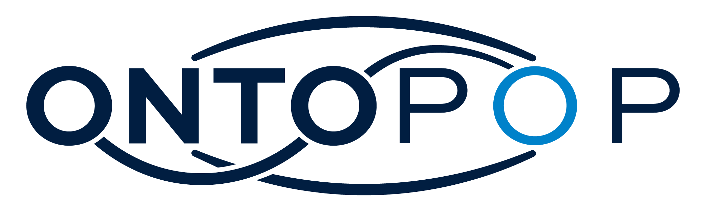
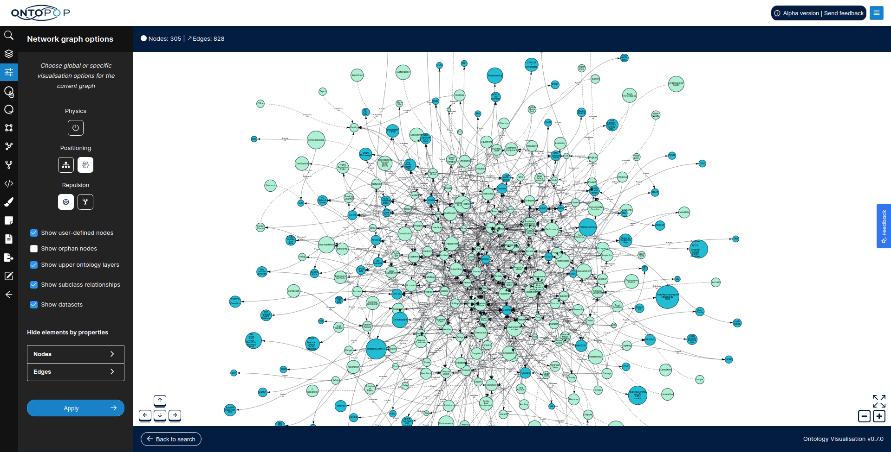

<!-- PROJECT LOGO -->
 

  
  <h3 align="center">OntoPop</h3>
  

    Open source framework enabling the visualisation, search, exploration and management of ontologies.
     
    <a href="https://ontopop.com" target="_blank"><strong>OntoPop Website</strong></a>
     
     
    <a href="https://ontopop.com" target="_blank"">Website</a>
    ·
    <a href="https://docs.ontopop.com" target="_blank"">Documentation</a>
  

 

||
|:---:|
|Screenshot of OntoPop https://ontopop.com|
 

## Table of Contents  
[1. Introduction](#introduction) 
&nbsp;&nbsp;&nbsp;&nbsp;[1.1. Vision](#vision) 
&nbsp;&nbsp;&nbsp;&nbsp;[1.2. Project Sponsors](#sponsors) 
&nbsp;&nbsp;&nbsp;&nbsp;[1.3. Frameworks](#frameworks) 
[2. Getting Started](#getting-started) 
[3. Roadmap](#roadmap) 
&nbsp;&nbsp;&nbsp;&nbsp;[3.1. Minimum Viable Product](#mvp) 
[4. Contributing](#contributing) 
[5. License](#license) 
[6. Contact and Further Information](#contact) 
[7. Acknowledgements](#acknowledgements) 
 

## 1. Introduction

OntoPop is an open source framework enabling the visualisation, search, exploration and management of ontologies.
 

### 1.1. Vision

The aim of OntoPop (formerly referred to as the Ontology Framework) is to design and develop a framework consisting of a series of open software services that together deliver the ability to visualise, search, explore and manage ontologies, thereby making ontologies accessible to a broader range of users beyond information and data architects.
 

### 1.2. Project Sponsors

[Highways England](https://highwaysengland.co.uk/) are the current primary sponsor of the OntoPop framework. The first use case of OntoPop at Highways England is to use the ontology visualisation to make their data landscape more accessible and visible to consumers of Highways England data, built upon the pre-existing and publicly available [Highways England ontology](https://webprotege.stanford.edu/#projects/0b3be685-73bd-4d5a-b866-e70d0ac7169b/edit/Classes).
 

### 1.3. Frameworks

OntoPop is built using the following primary open source frameworks:

Service | Description | Primary Frameworks
:--- | :--- | --- 
Data Pipeline | Ontology ingestion, semantic validation, parsing, modelling and loading | <ul><li>[OpenJDK 11](https://openjdk.java.net/projects/jdk/11/)</li><li>[OWL API](https://github.com/owlcs/owlapi/wiki)</li></ul>
Graph Computing Services | Graph-based modelling and interfaces | <ul><li>[OpenJDK 11](https://openjdk.java.net/projects/jdk/11/)</li><li>[Apache TinkerPop](https://tinkerpop.apache.org/)</li></ul>
APIs | Ontology, graph and vocabulary APIs | <ul><li>[OpenJDK 11](https://openjdk.java.net/projects/jdk/11/)</li><li>[Spring Framework](https://spring.io/)</li></ul>
UI Web App | User-facing ontology visualisation, search and management web application | <ul><li>[React](https://reactjs.org/)</li><li>[NextJs](https://nextjs.org/)</li><li>[Redux-zero](https://github.com/redux-zero/redux-zero)</li><li>[vis.js](https://visjs.org/)</li></ul>
 

## 2. Getting Started

Service | Description | Getting Started
:--- | :--- | :---
Backend Services | Java-based backend services including the ontology and graph data pipelines, graph computing services and APIs | [Link](ontology-services)
UI Web App | Javascript-based user-facing web application | [Link](https://github.com/hyperlearningai/ontology-visualisation)
 

## 3. Roadmap

Phase | Primary Sponsor | Deliverables | Timelines
:--- | :--- | :--- | :---
Minimum Viable Product (MVP) | Highways England | Series of open and scalable web services and APIs, and a user-facing web application, to enable the visualisation, search, exploration, navigation and management of ontologies, pre-loaded with the Highways England ontology in the first instance. | December 2020 - April 2021
 

### 3.1. Minimum Viable Product

The first phase of the OntoPop framework is the development of a minimum viable product (MVP) that delivers a series of open and scalable web services and APIs, and a user-facing web application, to enable the visualisation, search, exploration, navigation and management of ontologies, pre-loaded with the Highways England ontology in the first instance.
  

## 4. Contributing

OntoPop is a community-driven open source framework released under the [Creative Commons Attribution-ShareAlike 4.0](https://creativecommons.org/licenses/by-sa/4.0/) license. The best way to get started is by visiting the [OntoPop Wiki](https://docs.ontopop.com).
  

## 5. License

OntoPop is distributed under the [Creative Commons Attribution-ShareAlike 4.0](https://creativecommons.org/licenses/by-sa/4.0/) license. Please see [LICENSE](LICENSE) for more information.
  

## 6. Contact and Further Information

For further information and guidance, please contact:

* **Highways England** Primary Project Sponsor contactus@ontopop.com  
* **Jillur Quddus** Chief Data Scientist and Principal Polyglot Software Engineer contactus@hyperlearning.ai  

## 7. Acknowledgements

**Organisations**

* [Highways England](https://highwaysengland.co.uk/) - Primary Project Sponsor
* [Centre for Digital Built Britain](https://www.cdbb.cam.ac.uk/what-we-do/national-digital-twin-programme) - National Digital Twin Programme

**Teams and Individuals**

* [Jillur Quddus](https://hyperlearning.ai/team/jillurquddus) - Project Team Lead & Lead Engineer
* [Natasha Chowdory](https://hyperlearning.ai/team/natashachowdory) - Lead User Researcher
* [Christian Carestia](https://www.linkedin.com/in/christiancarestia) - Lead Front End Engineer
* [Michal Kostyal](https://www.linkedin.com/in/michalkostyal) - Front End Engineer
* [Tan Kent](https://www.linkedin.com/in/armandtan) - Front End Engineer

**Open Source Frameworks**

* [OpenJDK 11](https://openjdk.java.net/projects/jdk/11/)
* [OWL API](https://github.com/owlcs/owlapi/wiki)
* [Apache TinkerPop](https://tinkerpop.apache.org/)
* [Spring Framework](https://spring.io/)
* [React](https://reactjs.org/)
* [NextJs](https://nextjs.org/)
* [Redux-zero](https://github.com/redux-zero/redux-zero)
