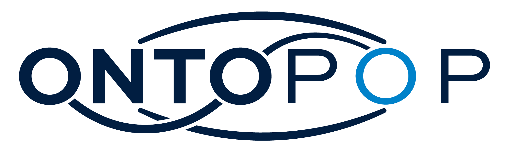
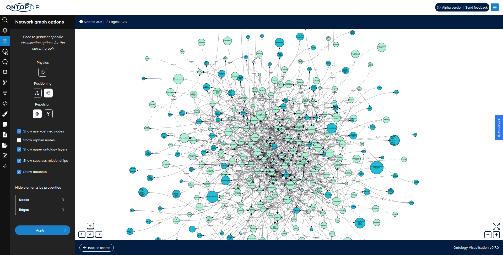

<!-- PROJECT LOGO -->
 

  
  

    OntoPop is an open-source collection of event-driven microservices and APIs that enable consumer applications to visualize, search, explore and manage version-controlled ontologies.
     
     
    <a href="https://ontopop.com" target="_blank"">Website</a> · <a href="https://docs.ontopop.com" target="_blank"">Documentation</a>
  

 

||
|:---:|
|Screenshot of OntoPop's native UI|
 

## Table of Contents  
[1. Introduction](#introduction) 
&nbsp;&nbsp;&nbsp;&nbsp;[1.1. Vision](#vision) 
&nbsp;&nbsp;&nbsp;&nbsp;[1.2. Project Sponsors](#sponsors) 
&nbsp;&nbsp;&nbsp;&nbsp;[1.3. Open Frameworks](#frameworks) 
[2. Design](#design) 
&nbsp;&nbsp;&nbsp;&nbsp;[2.1. Microservices](#microservices) 
&nbsp;&nbsp;&nbsp;&nbsp;[2.2. Design Principles](#principles) 
&nbsp;&nbsp;&nbsp;&nbsp;[2.3. Logical System Architecture](#architecture) 
[3. Getting Started](#getting-started) 
&nbsp;&nbsp;&nbsp;&nbsp;[3.1. Build from Source](#build) 
&nbsp;&nbsp;&nbsp;&nbsp;[3.2. Deployment](#deployment) 
[4. License](#license) 
[5. Acknowledgements](#acknowledgements) 
[6. Contact and Further Information](#contact) 
 

## 1. Introduction

OntoPop is an open-source collection of event-driven microservices and APIs that enable consumer applications to visualise, search, explore and manage version-controlled ontologies.
 

### 1.1. Vision

The goal of OntoPop is to make ontologies easier to understand and more accessible to a broader range of users beyond information and data architects. OntoPop achieves this by providing a collection of open-source software services that together enable downstream applications (including OntoPop's native UI app) to visualise, search, explore and manage version-controlled ontologies, thereby making the creation, manipulation, querying and management of ontologies significantly easier than when compared to current tools available on the market. OntoPop was built and is actively maintained by [HyperLearning AI](https://hyperlearning.ai/).
 

### 1.2. Project Sponsors

[National Highways](https://nationalhighways.co.uk/) (formerly Highways England) are the current primary sponsor of the OntoPop project. OntoPop is deployed at National Highways where it is being used to visualise and manage their ontology-based conceptual data model. Users, IT systems and suppliers alike at National Highways all use OntoPop to better understand what data exists across National Highways' entire data management landscape, where it is, who owns it, how to access it and how it can be linked together, thereby significantly improving data visibility, accessibility and governance.
 

### 1.3. Open Frameworks

OntoPop is primarily written in [Java 11](https://jdk.java.net/java-se-ri/11) and utilizes the following core open-source software frameworks and services:

* OpenJDK 11
* Spring Framework, including the following Spring projects:
  - Spring Boot
  - Spring Data
  - Spring Cloud
  - Spring Cloud Function
  - Spring Cloud Stream
  - Spring Cloud Vault
  - Spring Cloud AWS
  - Spring Cloud Azure
  - Spring Cloud GCP
  - Spring Security
  - Spring Vault
* Apache Maven
* Apache Commons
* Apache Jena
* Apache TinkerPop (including Gremlin)
* JanusGraph
* Elasticsearch
* RabbitMQ
* HashiCorp Vault
* Java OWL API
* Google Guava
* Git
* Node.js
